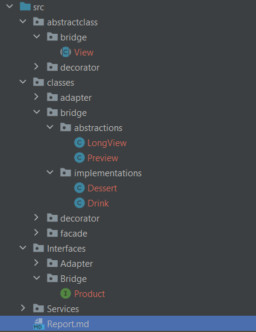

# Topic: Structural      Design Patterns.

## Course: Software design techniques

### Author: Dubina Valeria

## Theory

Structural design patterns explain how to assemble objects and classes into larger structures, while keeping these structures flexible and efficient.

The types of Structural design patterns are:

1. **Adapter Pattern** => A structural design pattern that adapts an interface into another according to
   client expectation.

2. **Bridge Pattern** => A structural design pattern that separates abstraction (interface) from implementation.

3. **Composite Pattern** => A structural design pattern that allows clients to operate on hierarchy of objects.

4. **Decorator Pattern** =>  A structural design pattern that adds functionality to an object dynamically.

5. **Facade Pattern** => A structural design pattern that provides an interface to a set of interfaces.

6. **Flyweight Pattern** => A structural design pattern that reuses an object by sharing it.

7. **Proxy Pattern** => A structural design pattern that is used to represent another object.

## Objectives:
The objective of this laboratory work is to **implement 5 of the structural design
patterns** and to explain them properly.

## Implementation description
For the purpose of this laboratory work, to illustrate 5 design patters, a simulation of a restaurant was implemented.
To make it simple to understand the classes and interfaces have separate packages for the type of design pattern.

The following design patterns were implemented: **Bridge**, **Adapter**, **Decorator**, **Facade**, **Proxy** the details
of their implementation will be discussed in the following chapters.

### Bridge Design Pattern
This is a structural design pattern that allows clients to operate on hierarchy of objects.

the terms Abstraction and Implementation as part of the Bridge definition. _Abstraction_ is a high-level 
control layer for some entity. This layer isn’t supposed to do any real work on its own. It should delegate the work to the _implementation_ layer.

In this project with the use of Bridge design pattern is linked the Product views. In the productions there are 
lots of cases when we need to display only the preview of a product or to show all detailed information.
The abstractions are represented by the classes `Preview` and `LongView` that implement the
same abstract class `View` that handles the display of the product.
```java
public abstract class View {
protected Product product;

    public Product getProduct() {
        return product;
    }

    public void setProduct(Product product) {
        this.product = product;
    }

    public abstract String generate();
}
```
The `Product` is a part of _implementations_, `Product` interface is implemented by the
`Dessert` and `Drink` classes, they call the same `getProductsList` despite the fact
that drinks does not have a product list but has a description instead, as the project 
grow and different type of Products appear we can  have the same view for everyone
because of the decoupling from the implementation.


### Decorator Design Pattern

A structural design pattern that adds functionality to an object dynamically.

In this project it is used to add more Toppings to a `dessert` class and dynamically
calculate the cost of the final product.

This pattern uses the Base class and adds on it the decorator class instance. So we have
the `DessertToppingDecorator` class witch serves as the base decorator class. Here 
the pointer to the Base Product is set and all the information about the product (such as price and product list) is retrieved.
```java
public abstract class DessertToppingDecorator implements Product {
    protected Product dessert;

    public DessertToppingDecorator(Product dessert) {
        this.dessert = dessert;
    }

    public String getTitle() {
        return dessert.getTitle();
    }

    public String getPrice() {
        return dessert.getPrice();
    }

    public String getProductsList() {
        return dessert.getProductsList();
    }

    public String getImgUrl() {
        return dessert.getImgUrl();
    }
}
```
Now we have to implement the concrete representations of the Toppings, so we have
chocolate and caramel, booth of them works the same. Its constructor gets the pointer to the
version of product:
```java
public class Caramel extends DessertToppingDecorator {
   private final String price = "15";
   private final String title = "caramel";

   public Caramel(Product dessert) {
      super(dessert);
   }
}
```
And overwrites the methods `getProductList` and `getPrice` by calling the price and product
list of the previous object and adds implementation above it:
```java
    public String getPrice() {
        return String.valueOf(Integer.parseInt(dessert.getPrice()) + Integer.parseInt(this.price));
    }

    public String getProductsList() {
        return dessert.getProductsList() + ", " + this.title;
    }
```

### Adapter Design Pattern

It is a structural design pattern that adapts an interface into another according to
client expectation. Imagine cases when you are not sure of the delivery system that
you want to integrate within your project and you have to be prepared to change it
any time. To avoid the coupling with the integrated delivery system API we could use Adapter pattern
to set the expected functionality to our service, so that we would change the adaptee
any time we want.

For this purpose we have a `DeliveryServiceAdapter` that sets the expected functionality
of our system.
```java
public interface DeliveryServiceAdapter {
    public void placeOrder(ArrayList<Product> products);
}
```
The concrete implementation of the Adapter interface uses lets say the API of `GlovoDeliveryService`
that has this function to place order:
```java
    public void placeOrder(ArrayList<String> productList, String expectedTime) {
        System.out.println("Glove is processing the order...");
        // Doing something in here
        System.out.println("Order placed successfully!!");
    }
```
But in our project to place a order we use an `ArrayList<Product>` instead of `ArrayList<String>` as in glovo case and we don't have the expected time set,
so we make an adapter for that.
```java
public class DeliveryService implements DeliveryServiceAdapter {
    GlovoDeliveryService glovo = new GlovoDeliveryService();

    @Override
    public void placeOrder(ArrayList<Product> products) {
        ArrayList<String> productsToString = new ArrayList<>();

        products.forEach(product -> {
            productsToString.add(product.getTitle());
        });

        glovo.placeOrder(productsToString, "18:00");
    }
}
```
Now we can work directly with the `DeliveryServiceAdapter` concrete implementations and everything will work just fine!

### Facade
To hide the complexity from the Client Code we can use `Facade design pattern`.
In our case, to hide the complexity of the payment service we have:
   ```java
public interface PaymentService {
    public void pay();
}
```
that is implemented by the `PaymentServiceFacade` that has the logic of checking the account
and paying 
```java
public class PaymentServiceFacade implements PaymentService {
   private int accountNr;
   AccountManagerProxy manager;
   Bank bank;


   public PaymentServiceFacade(int accountNr) {
      this.accountNr = accountNr;

      Bank bank = new Bank();
      AccountState manager = new AccountManagerProxy();
   }
}
```

### Proxy

It is a structural design pattern that is used to represent another object. There are three 
types of Proxy design usage, but in this project is used for the security measure.

There is an `AccountManagerService` that manages the account within a bank, it
can add, delete, update and get info about accounts.
```java
public class AccountManager {

    public boolean hasSufficientCredit(int accountNumber) {
        // Process account details
        System.out.println("Processing account "+ accountNumber);

        return true;
    }
            // ...
}
```

This class is also used in `PaymentServiceFacade` just fo the checking 
the account status existence. Not to open all this possibility to `PaymentServiceFacade`
class a Proxy is used.

A new class `AccountManagerServiceProxy` was implemented that implements `AccountState` interface
this  guarantees that booth, the proxy and the base object have the implementation of
that function:
```java
public interface AccountState {
    public boolean hasSufficientCredit(int accountNumber);
}
```
```java
public class AccountManagerProxy implements AccountState {
    @Override
    public boolean hasSufficientCredit(int accountNumber) {
        // Processing ...
        return true;
    }
}
```